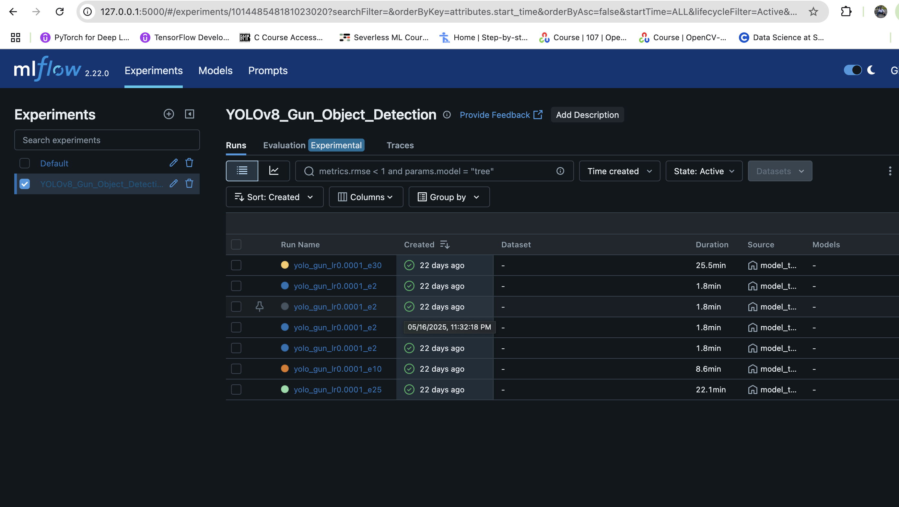

# 🚀 Custom Guns Object Detection with TensorBoard, DVC, FastAPI & Postman

This repository contains the implementation of an **object detection system** designed to detect custom guns in images. The project leverages modern MLOps tools such as **Mlflow**, **DVC (Data Version Control)**, **FastAPI**, and **Postman** to build, train, deploy, and test the model effectively.

## 🎯 Project Objective

To develop an object detection model capable of identifying custom guns in images, ensuring high accuracy and real-time performance. The project also focuses on automating the ML workflow using MLOps best practices.

## 📌 Project Highlights

- ✅ Data ingestion using Kaggle  
- 📊 Jupyter Notebook testing and exploratory data analysis  
- 🔧 Data processing and feature engineering  
- 🏗️ Building and training a robust model architecture  
- 📈 Experiment tracking using Ultralytics
- 🛠️ Training pipeline automation using DVC  
- 📦 Data and code versioning with Git and DVC  
- 🌐 Deployment-ready API using FastAPI  
- 🖥️ Testing and validation using Postman  

## 📂 Dataset

- **Source**: Kaggle  
- **Details**: A dataset containing images labeled for custom guns.  
- **Usage**: Used for training and validating the object detection model.

## 🧑‍💻 Tech Stack

- **Python**
- **Jupyter Notebook**
- **Ultralytics** (for model building)
- **Mlflow** (for experiment tracking)
- **DVC** (for data version control)
- **FastAPI** (for deploying the model as an API)
- **Postman** (for API testing)
- **Git** (for code version control)

## 📋 Workflow Overview

1. **Project Setup**  
   - Define folder structure, virtual environment, config files, and custom modules.

2. **Data Ingestion**  
   - Fetch and organize the dataset from Kaggle.

3. **Jupyter Notebook Testing**  
   - Initial exploration and testing of the dataset using Jupyter Notebooks.

4. **Data Processing**  
   - Clean, preprocess, and augment the dataset for better model performance.

5. **Model Architecture**  
   - Design and implement the object detection model using Yolov8

6. **Model Training**  
   - Train the model using ultralytics leveraging GPU acceleration if available.

7. **Experiment Tracking**  
   - Use mlflow to log and visualize training metrics, losses, and other important parameters.

8. **Training Pipeline**  
   - Automate the training process using DVC pipelines for reproducibility.

9. **Data & Code Versioning**  
   - Store code and data using Git and DVC for version control.

10. **Deployment**  
    - Deploy the trained model as a REST API using FastAPI.
    - Test the API endpoints using Postman.

## 🚀 Future Scope

- Integrate CI/CD pipelines for automated testing and deployment.
- Deploy the model to cloud platforms like AWS, GCP, or Azure.
- Expand the model to handle real-time predictions via streaming APIs.
- Enhance the model's accuracy through hyperparameter tuning and advanced techniques.

## 💬 Notes

This project emphasizes hands-on learning of MLOps tools such as Mlflow, DVC, and FastAPI, which are essential skills for modern ML engineers.

## 📝 Table of Contents (Based on Videos)

The project follows the structure outlined in the video series:

1. **Introduction to the Project**
2. **Project Setup**
3. **Data Ingestion using Kaggle**
4. **Jupyter Notebook Testing**
5. **Data Processing**
6. **Building Model Architecture**
7. **Model Training**
8. **Experiment Tracking using Mlflow**
9. **Training Pipeline using DVC**
10. **Data and Code Versioning**

Below is a preview of the FastAPI documentation UI

*FastAPI Swagger UI*

*Status of Mlflow UI*

